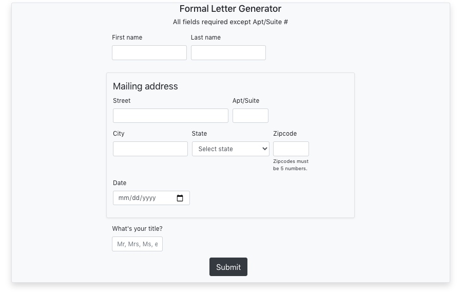
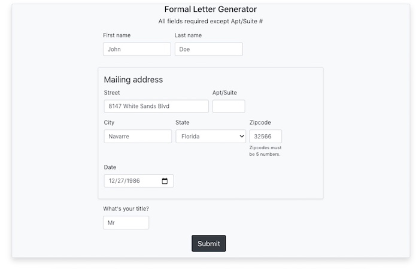
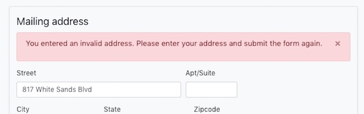

# Formal Letter Generator

## Description

This project was bootstrapped with [Create React App](https://github.com/facebook/create-react-app).

This React application takes in a user's information such as name and address and then uses that information to generate a formal letter. All letters generated contain the same bulk text except for specific areas in the letter such as where a name and address would typically go.

Address information is filtered and returned using a geolocation API that presents a list of valid addresses in which the user can select. There is also the option to go back and re-enter information if there was a mistake using a button located at the bottom of the generated letter.

## Installation

This project has a backend proxy written in Node.js with Express that serves the environment variables that contain the API key and directly interfaces with the [SmartyStreets US Street Address API](https://smartystreets.com/docs/cloud/us-street-api).

I hosted the back-end on Heroku and the front-end on Netlify. The folder structure has a mostly empty root with the main development scripts contained in `/server` whereas the front-end is `/client`.

The main development script is `npm run dev` which will serve both back and front-end. This has to be run from `/server`

Fork this project and run `npm install` within your terminal from both `/server` and `/client`. It should install all needed dependencies within `/server/package.json` and `/client/package.json`.

### Note:

This project requires Node v14 and above as well as the `testing-library/jest-dom`, `testing-library/react`, and `testing-library/user-event` dependencies. Testing also requires a dev dependency of `react-test-renderer`.

## Usage

First, enter the user information. All fields are required except for the apartment or suite number.

If the address entered is valid, meaning it exists, a modal will open with a list of possible addresses to confirm. There is also an option 'I do not see my address here." which will take you back to the form. Otherwise confirm your address.

Finally the formal letter will be displayed with your information filled out automatically.

There is also a button to take you back to the form.

If the address is invalid, an error message will be displayed. If there happens to be any issue with the app, a relevant error message will also be displayed.

## Deployment

Since the folder structure is ~/client and ~/server, git subtrees have to be used in order to properly deploy. For the server host Heroku that would be `git subtree push --prefix path/to/subdirectory heroku master`.

## Support

Contact me on Twitter [@kylewcode](https://twitter.com/kylewcode) or leave a Git issue.

## Acknowledgment

Thanks to the [Orlando Devs](https://orlandodevs.com/) for the advice and guidance in creating this.

## License

[MIT License](https://choosealicense.com/licenses/mit/#)
